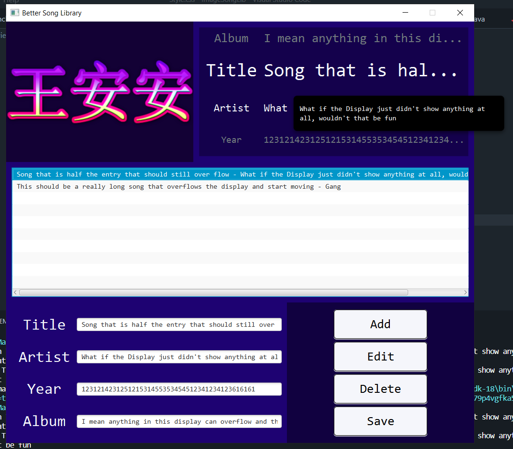
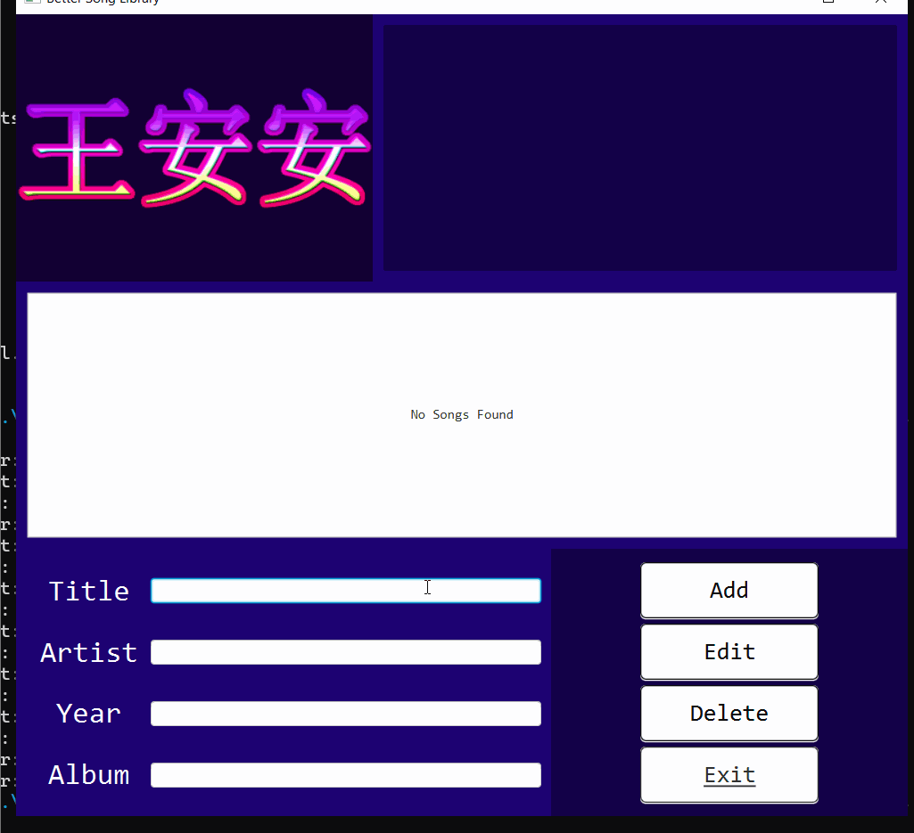
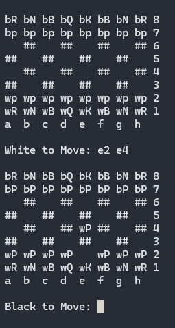
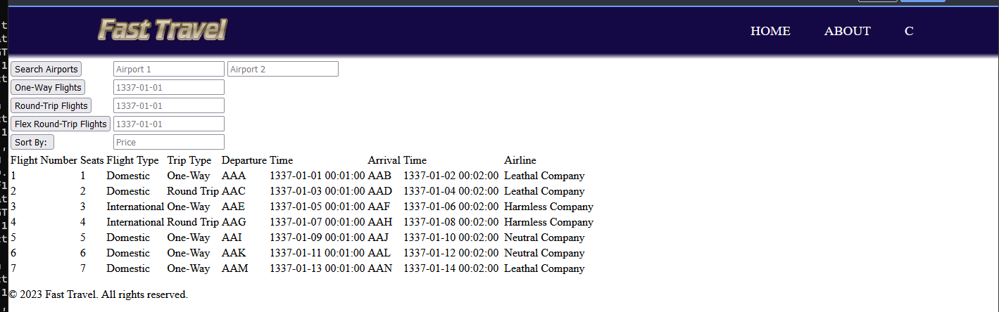

Assignments that I had fun on. Albeit projects that "everyone" has done.

## Table of Contents

- [Song Library](#digital-song-library)
- [Terminal-based Chess](#terminal-based-chess)
- [Mock Airport Booking Website](#airport-website)

---

### Digital Song Library 
*Java-based Graphical User Interface to list songs*  
**Technologies Used**: Java, JavaFX

<!--  -->   
  
- [View Code](https://github.com/PassingBoredom/glassshelf/tree/main/Song%20Library)

### Terminal-based Chess 
*playable ascii chess via Terminal*  
**Technologies Used**: Java 

  
- [View Code](https://github.com/PassingBoredom/glassshelf/tree/main/Chess)

### Airport Website 
*Website to mimic airport bookings*  
**Technologies Used**: HTML, CSS, JSP, Java, SQL

  
- [View Code](https://github.com/PassingBoredom/glassshelf/tree/main/Airport)
