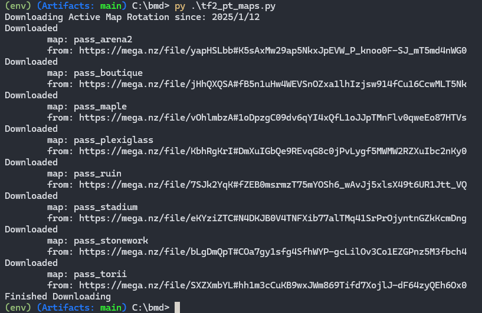

A showcase of some projects. Creating needlessly complicated solutions for relatively simple problems.

<!-- ## Table of Contents                             -->
<!-- - [Status Checker](#web-scraper-status-checker)  -->
<!-- - [Automated File Grabber](#file-grabber)        -->

---

## Web Scraper Status Checker 
*Scrape Rutgers IlabStatus page and display status directly into shell*  
**Technologies Used**: Python

  
- [Code](https://github.com/PassingBoredom/glassshelf/tree/main/Status%20Checker)

--- 

## File Grabber
*Scrape latest version of maps*  
**Technologies Used**: Python

                               
- [Code](https://github.com/PassingBoredom/glassshelf/tree/main/File%20Grabber)  

---

## GUI Router Monitor
*Graphic User Interace to use web scraper to monitor router status*  
**Technologies Used**: Rust

- [Code](https://github.com/PassingBoredom/glassshelf/tree/main/GUI%20Monitor)