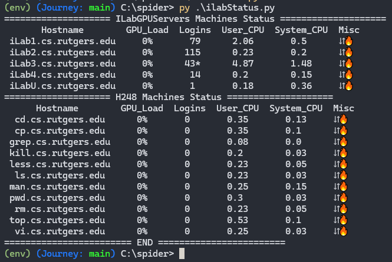
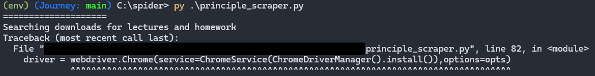
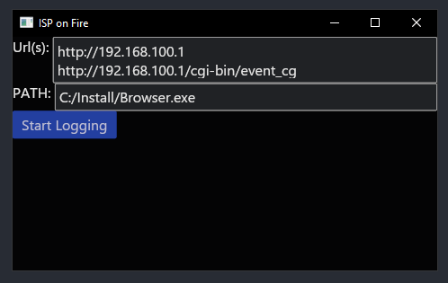

A showcase of some projects. Creating needlessly complicated solutions for relatively simple problems.

<!-- ## Table of Contents                             -->
<!-- - [Status Checker](#web-scraper-status-checker)  -->
<!-- - [Automated File Grabber](#file-grabber)        -->

---

## Web Scraper Status Checker 
*Scrape Rutgers IlabStatus page and display status directly into shell*  
**Technologies Used**: Python

  
- [Code](https://github.com/PassingBoredom/glassshelf/tree/main/Status%20Checker)

--- 

## File Grabber 
*Scrape professor's class page and download lectures and homeworks that aren't on my device*  
**Technologies Used**: Python

<!--                                  -->
<!-- - [Code](https://github.com/PassingBoredom/glassshelf/tree/main/File%20Grabber)  -->
<!-- 	- Non-Functional image since I'm no longer using Chrome binaries              -->
- Non-Functional, no longer using Chrome binaries. 
- Have to rebuild the program 

## GUI Router Monitor
* Graphic User Interace to use web scraper to monitor router status*
**Technologies Used**: Rust

- [Code]()